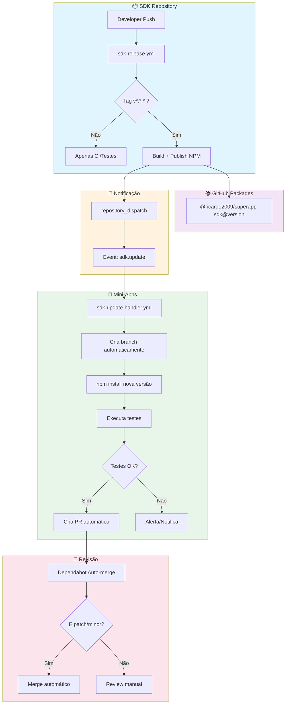
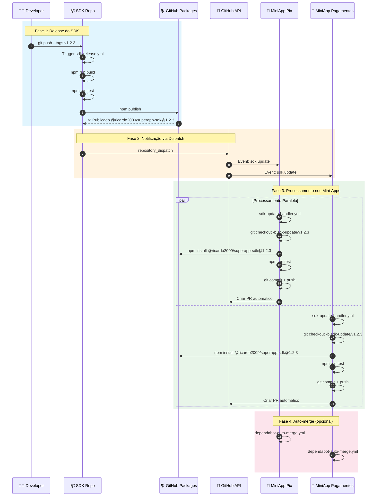
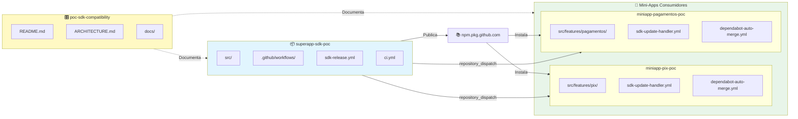
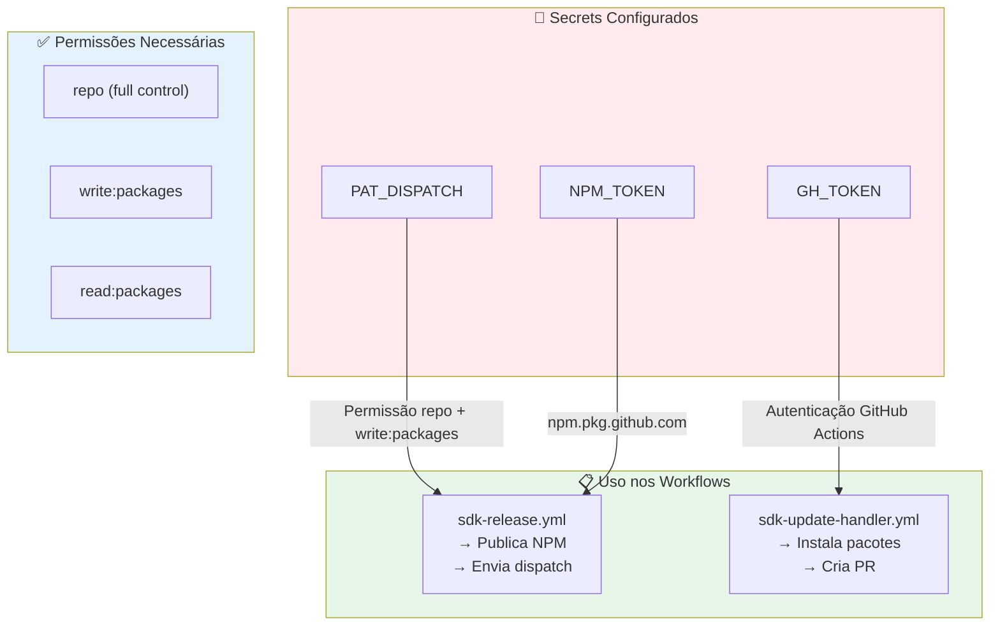
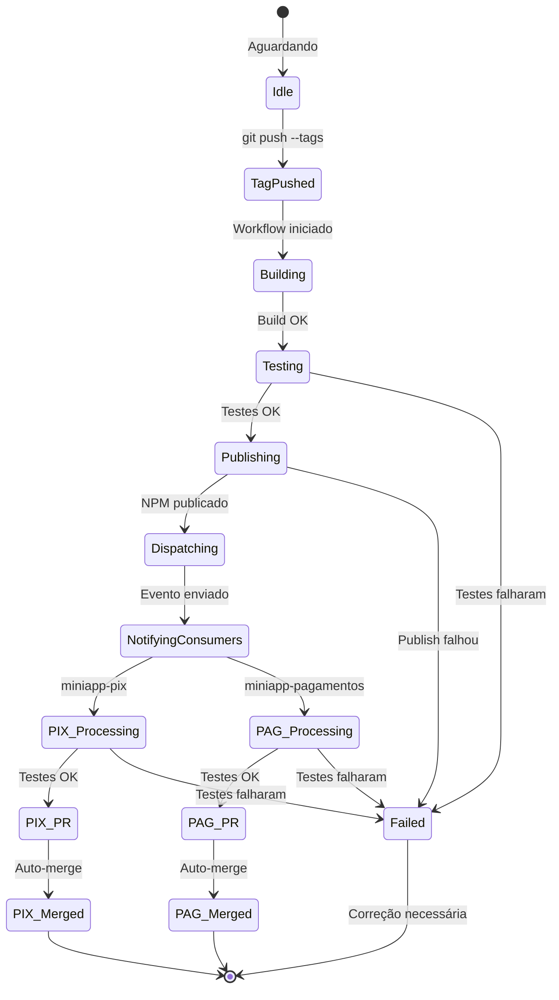
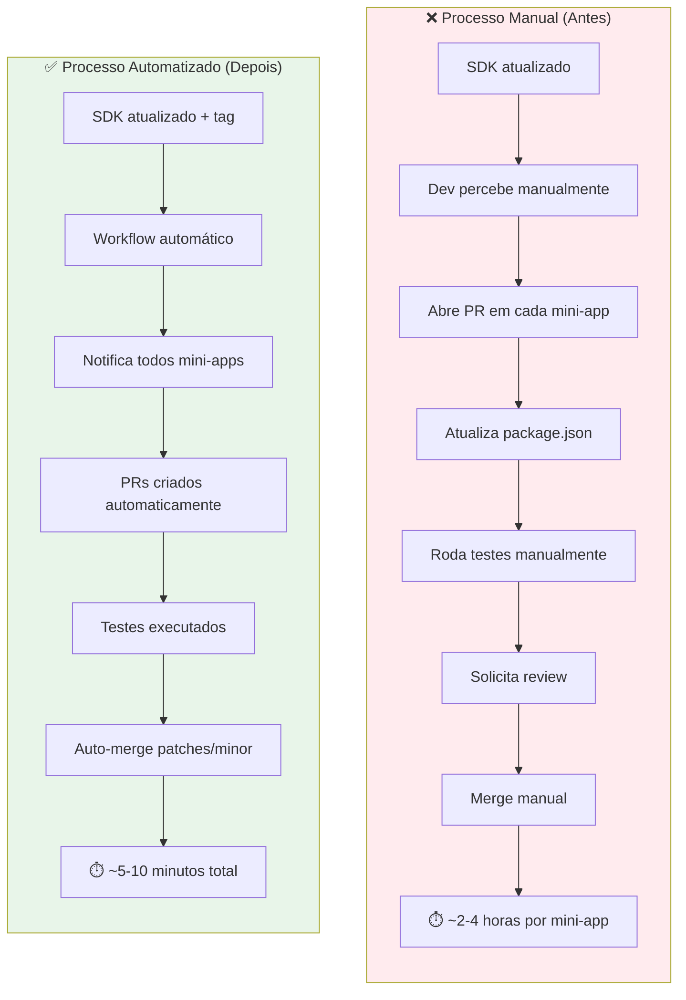

# 📊 SDK Compatibility - Fluxo Completo com Diagramas

Este documento apresenta diagramas visuais do fluxo completo de automação de compatibilidade SDK-MiniApps.

---

## 🎯 Visão Geral do Sistema

---

## 🔄 Diagrama de Sequência - Ciclo Completo

---

## 📁 Estrutura dos Repositórios

---

## 🔐 Fluxo de Autenticação

---

## ⚙️ Estados do Workflow

---

## 📊 Comparação: Antes vs Depois

---

## 🔔 Configuração do Repository Dispatch

```mermaid
flowchart LR
    subgraph SDK["SDK Repository"]
        A["sdk-release.yml"]
        B["curl POST dispatch"]
    end
    
    subgraph Payload["📦 Payload JSON"]
        C["event_type: sdk.update"]
        D["client_payload.version"]
        E["client_payload.changes"]
    end
    
    subgraph Consumers["Mini-Apps"]
        F["on: repository_dispatch"]
        G["types: [sdk.update]"]
        H["github.event.client_payload"]
    end
    
    A --> B
    B --> C
    C --> D
    D --> E
    E --> F
    F --> G
    G --> H
    
    style SDK fill:#e1f5fe
    style Payload fill:#fff3e0
    style Consumers fill:#e8f5e9
```

---

## 📈 Métricas de Sucesso

| Métrica | Antes | Depois | Melhoria |
|---------|-------|--------|----------|
| Tempo para propagar SDK | 2-4 horas | 5-10 min | **95%** |
| Intervenção manual | Sempre | Só majors | **80%** |
| Erros de sincronização | Frequentes | Raros | **90%** |
| Cobertura de testes | Manual | Automática | **100%** |

---

## 🔗 Links Relacionados

- [HANDS-ON-GUIDE.md](./HANDS-ON-GUIDE.md) - Guia passo-a-passo
- [TESTING-GUIDE.md](./TESTING-GUIDE.md) - Guia de testes E2E
- [troubleshooting.md](./troubleshooting.md) - Resolução de problemas
- [adding-consumer.md](./adding-consumer.md) - Como adicionar mini-apps
- [ARCHITECTURE.md](../ARCHITECTURE.md) - Arquitetura detalhada

---

## ✅ Resumo

Este sistema de automação elimina a necessidade de sincronização manual entre SDK e mini-apps, garantindo:

1. **Propagação automática** de atualizações
2. **Testes de compatibilidade** executados automaticamente
3. **PRs criados sem intervenção** humana
4. **Auto-merge** para atualizações seguras (patch/minor)
5. **Notificação** em caso de breaking changes

> **💡 Dica:** Execute o [hands-on](./HANDS-ON-GUIDE.md) para ver todo este fluxo funcionando na prática!
